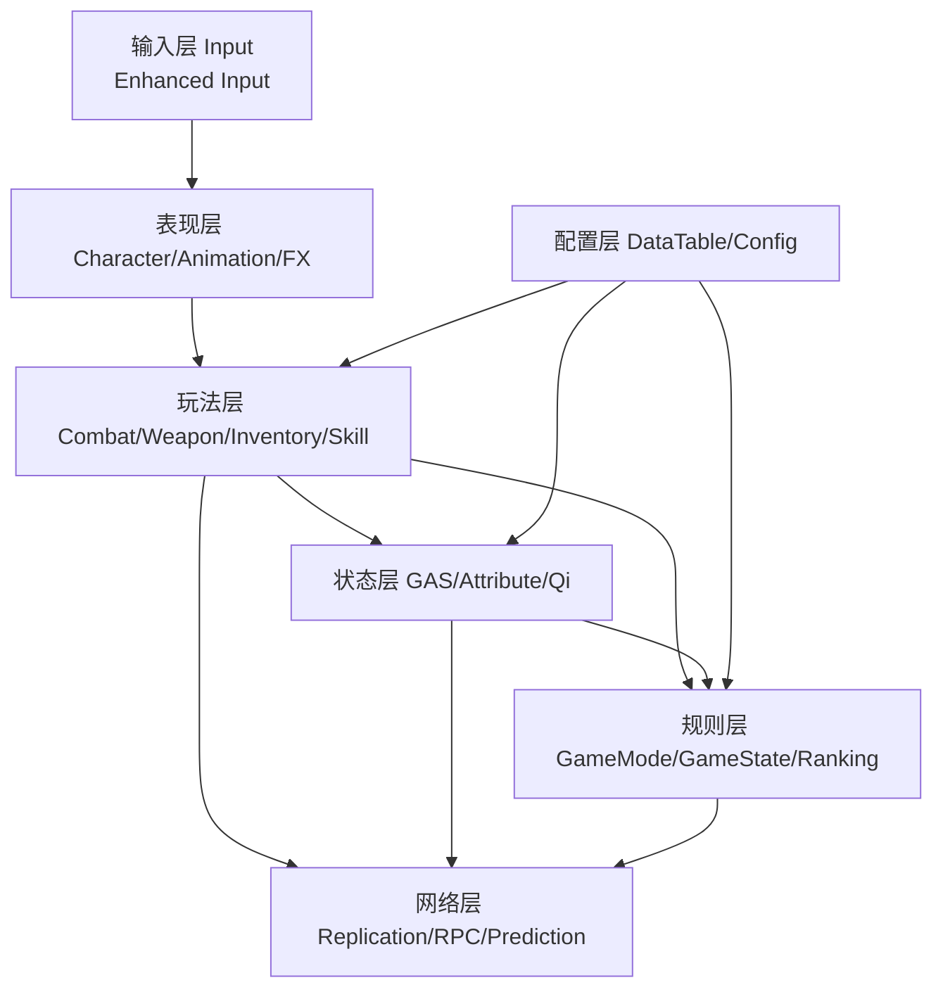
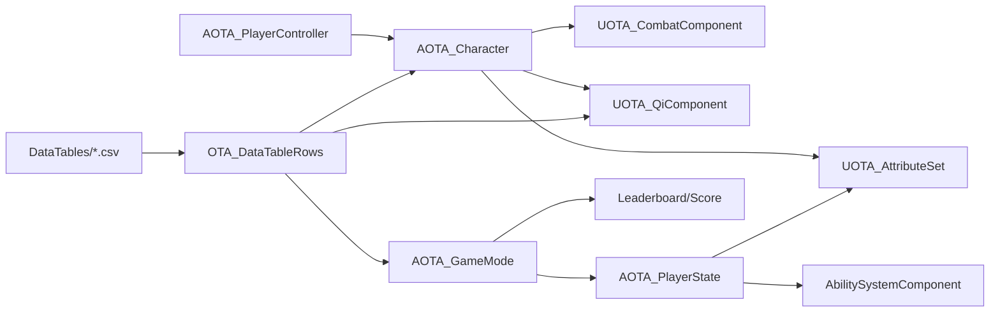
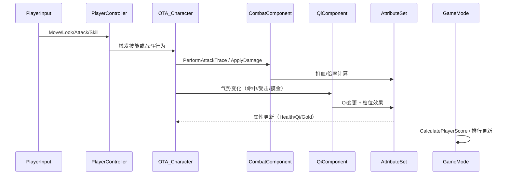
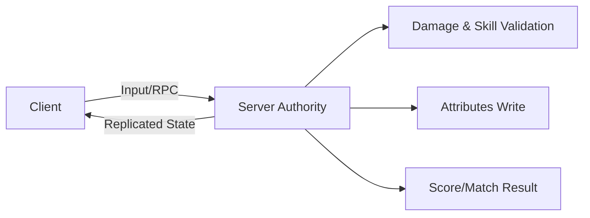

# OTA 项目框架图（先行版）

> 目标：先把 **FPS射击 + 近战博弈 + 对战 + 武器 + 背包 + 联机** 的工程框架固定下来，确保后续实现不跑偏。
> 执行细分版：见 `docs/project_architecture_breakdown.md`（模块边界 / 依赖方向 / 迁移里程碑）。
> 文档导航：见 `docs/README.md`。

---

## 1) 总体分层

---

## 2) 运行时核心模块（C++）

---

## 3) 主循环（对局）

---

## 4) 联机权威边界（必须固定）

- **客户端（预测/输入）**
  - 输入采集、镜头、UI 展示
  - 允许做轻预测（动画、反馈）
- **服务器（权威）**
  - 伤害结算
  - 技能可用性与冷却
  - 属性写入（Health/Qi/Gold/Kill）
  - 排行与比赛结束判定

---

## 5) DataTable 框架（策划可直接改）

当前建议 4 张核心表：

1. `DT_OTA_Skills.csv`：技能消耗、持续、公共CD、特例参数（如冲刺距离）
2. `DT_OTA_GoldGrowth.csv`：金币成长档位与倍率
3. `DT_OTA_QiLevels.csv`：气势区间与攻速/移速/回气倍率
4. `DT_OTA_ScoreRules.csv`：击杀与金币权重

对应行结构已在 `Source/CarRenderFactory/Data/OTA_DataTableRows.h`。

---

## 6) 迭代顺序（先框架后细节）

- **Phase A（当前）**：框架锁定（模块职责 + 网络权威 + 表结构）
- **Phase B**：P0 主链路（射击/近战手感、武器、背包、联机基础同步）
- **Phase C**：P1 稳定化（延迟一致性、断线恢复、排名结算）
- **Phase D**：P2 边缘功能（摸金验证开关化）

---

## 7) 交付物清单（框架阶段）

- [x] 架构总图（本文档）
- [x] DataTable 结构定义
- [x] DataTable 初始数据
- [ ] 运行态联机验证（PIE 多人）
- [ ] 武器/背包完整链路
