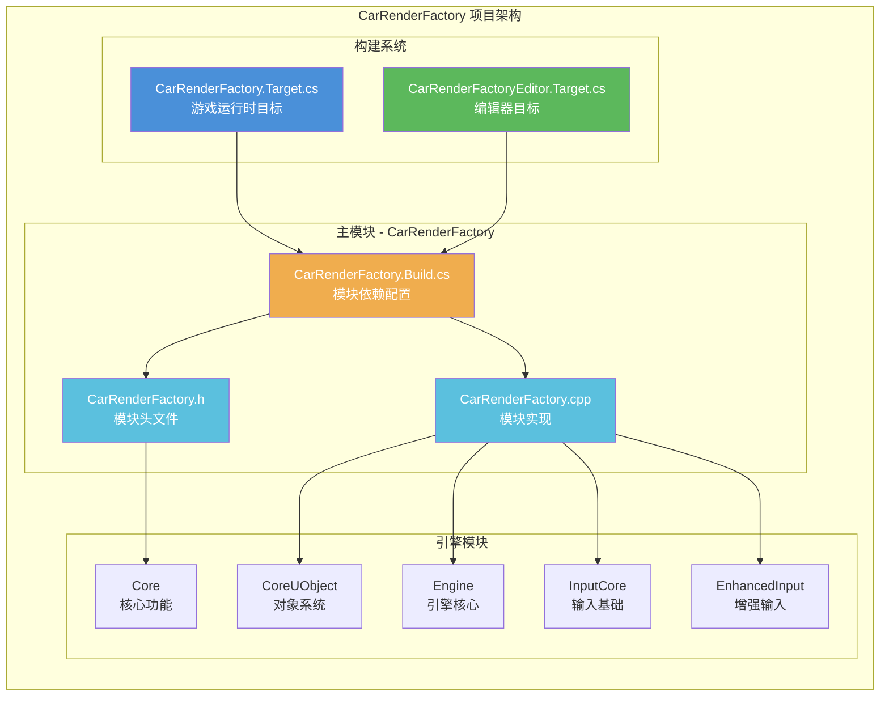
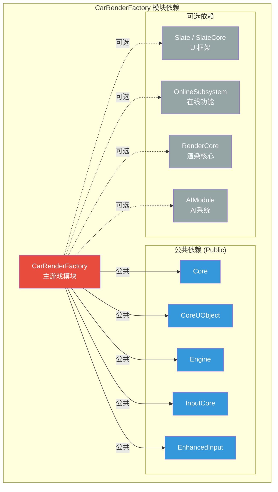
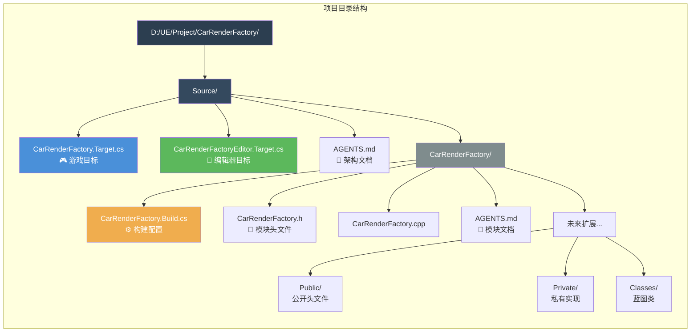
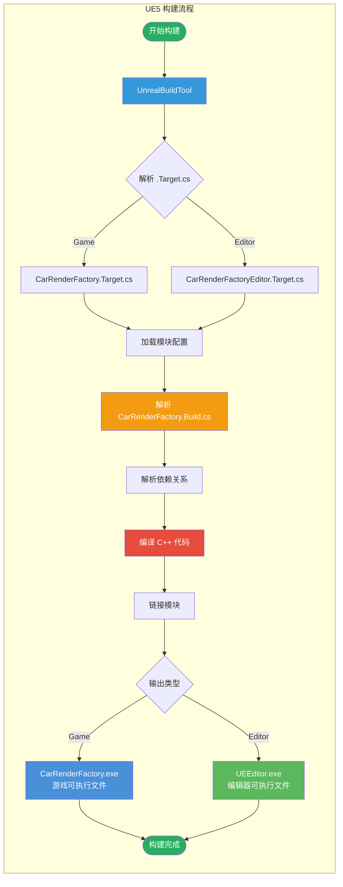
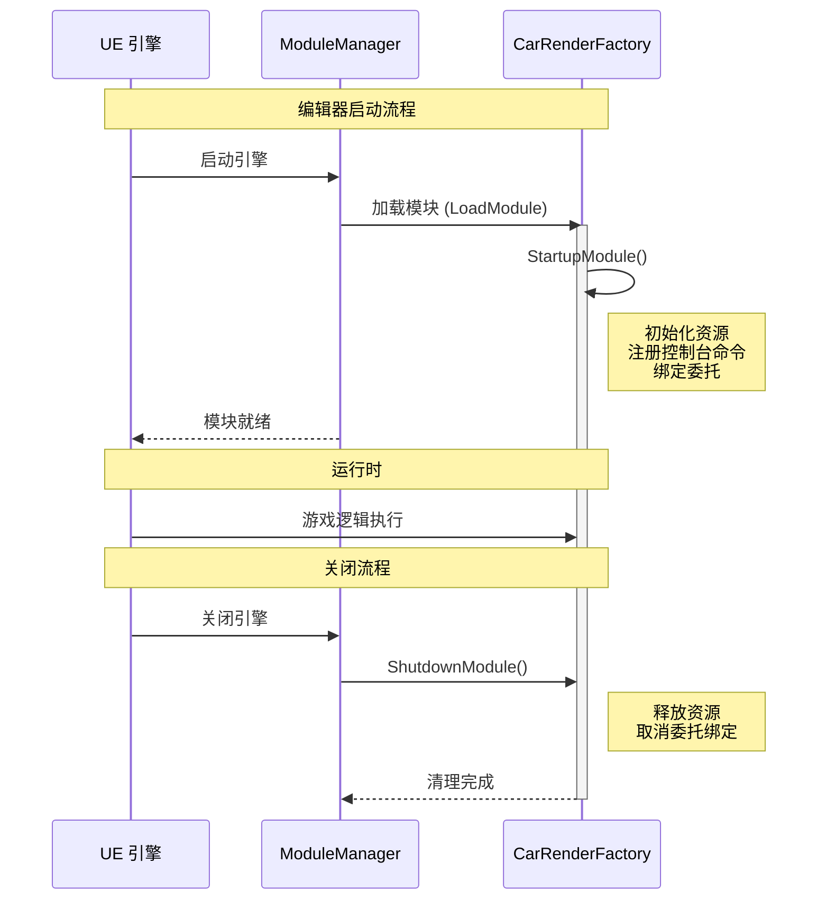
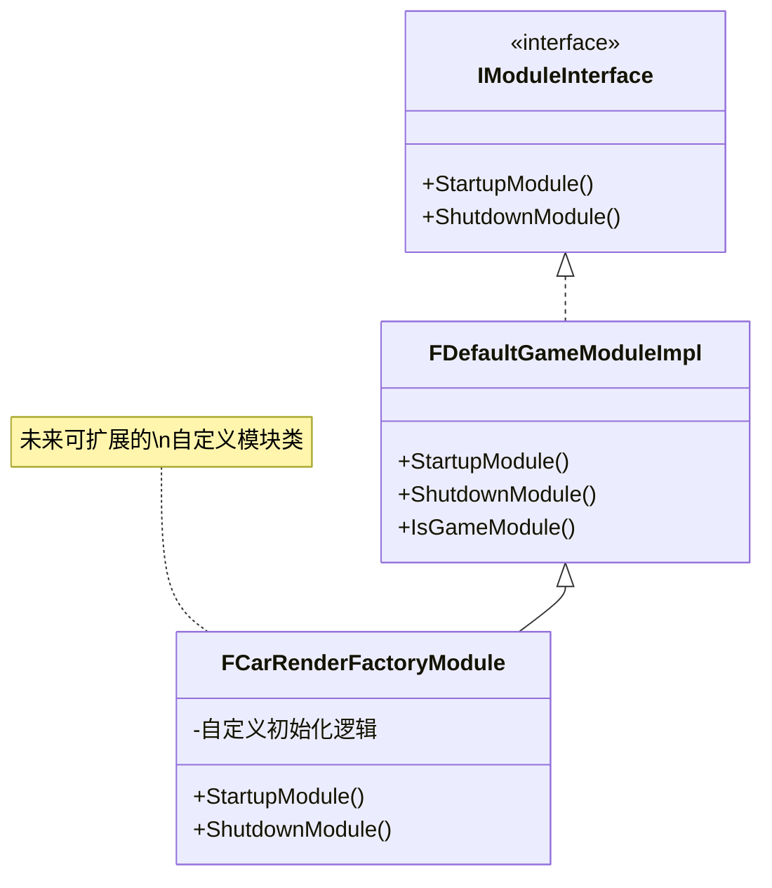
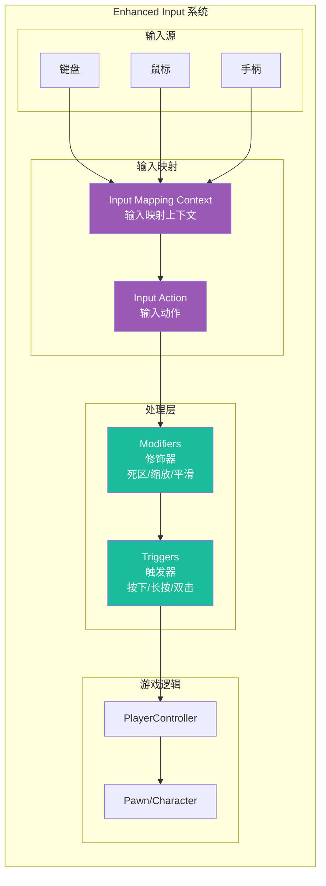
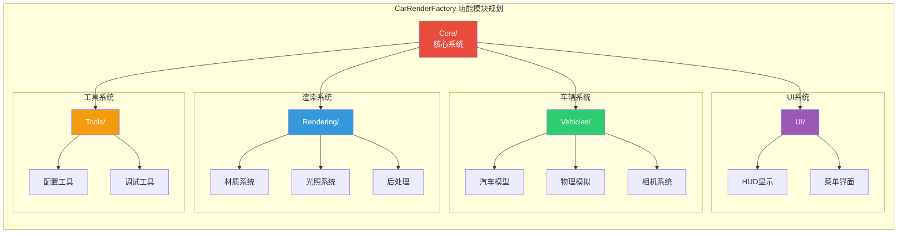
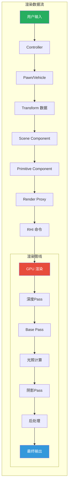
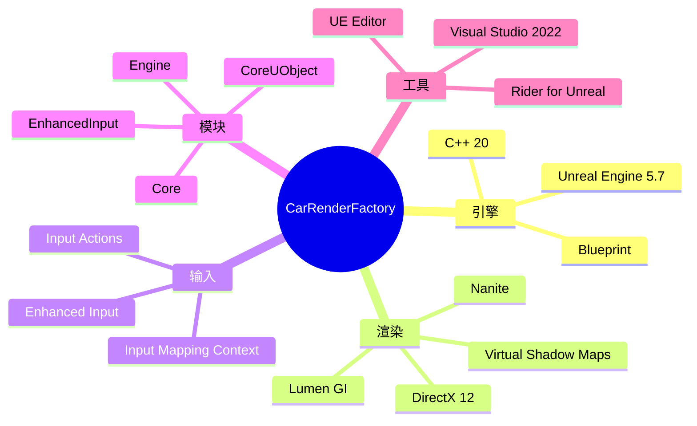

# CarRenderFactory 架构文档

## 项目概述

汽车渲染工厂 (CarRenderFactory) 是一个基于 Unreal Engine 5.7 的汽车渲染和可视化项目。

---

## 1. 项目整体架构

---

## 2. 模块依赖关系

---

## 3. 目录结构

---

## 4. 构建流程

---

## 5. 模块生命周期

---

## 6. 类继承结构 (规划)

---

## 7. 输入系统架构

---

## 8. 建议的功能模块划分

---

## 9. 数据流架构

---

## 10. 技术栈总览

---

## 快速导航

| 文档 | 路径 | 说明 |
|------|------|------|
| 根目录文档 | [Source/AGENTS.md](./AGENTS.md) | 项目整体说明 |
| 模块文档 | [CarRenderFactory/AGENTS.md](./CarRenderFactory/AGENTS.md) | 主模块详情 |

---

*文档生成时间: 2026-03-30*
